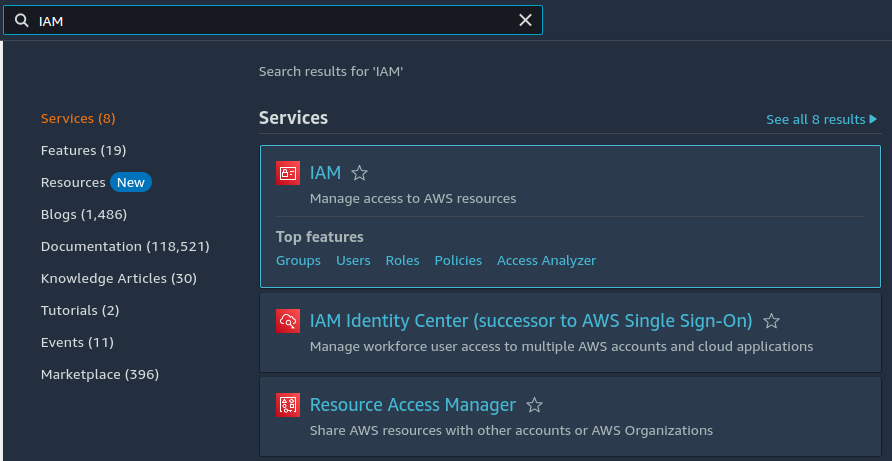
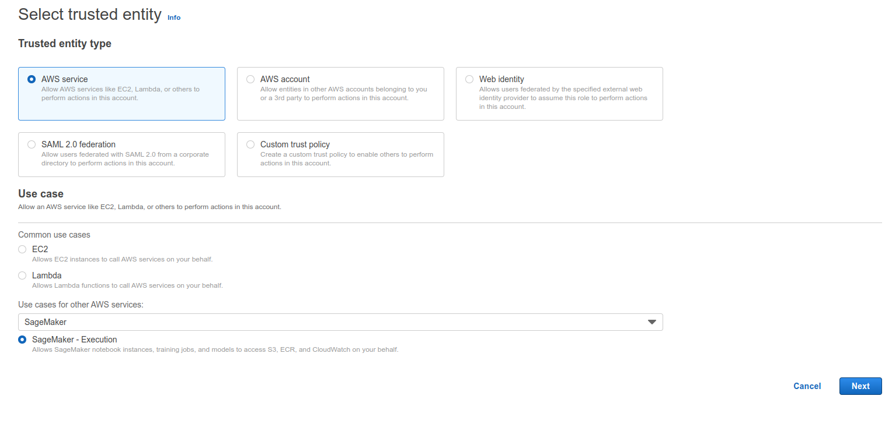
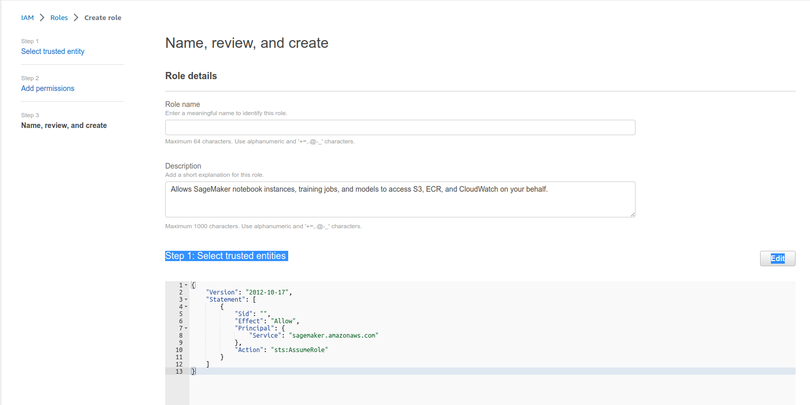
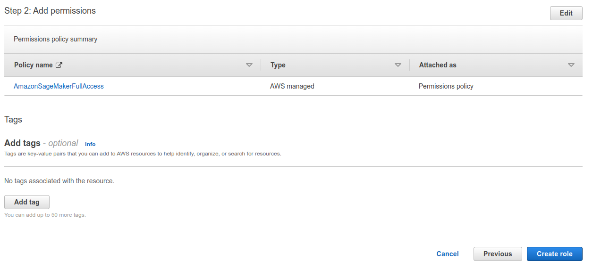
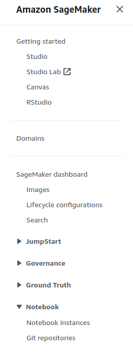
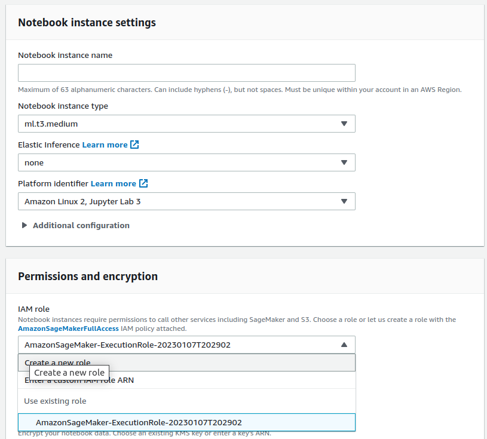
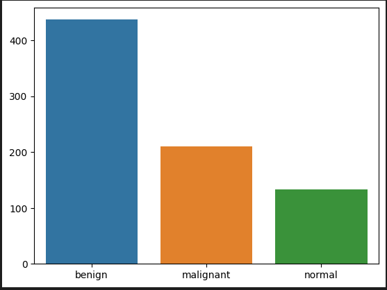
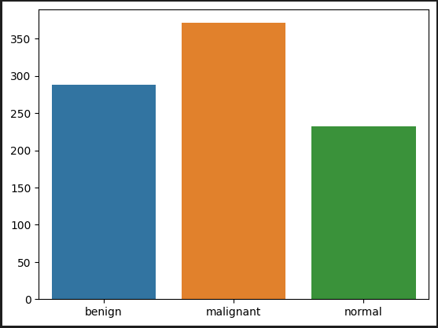
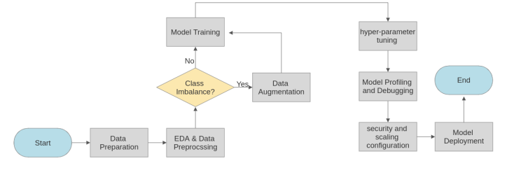
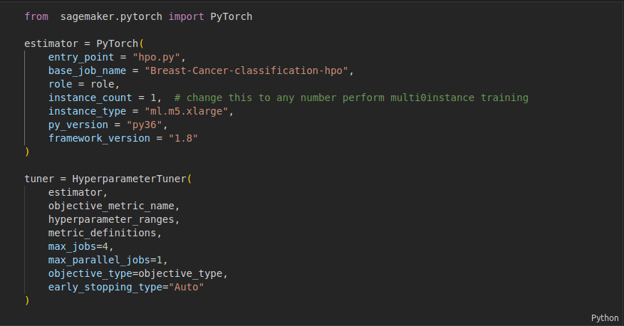

# Segmentation and Classification of Breast Cancer In Breast Ultrasound Images Using Deep Learning

  
Breast cancer is one of the most common causes of death among women worldwide. Early detection helps in reducing the number of early deaths. 

In 2020, there were 2.3 million women diagnosed with breast cancer and 685 000 deaths globally. As of the end of 2020, there were 7.8 million women alive who were diagnosed with breast cancer in the past 5 years, making it the world’s most prevalent cancer. There are more lost disability-adjusted life years (DALYs) by women to breast cancer globally than any other type of cancer.  Breast cancer occurs in every country of the world in women at any age after puberty but with increasing rates in later life. [WHO](https://www.who.int/news-room/fact-sheets/detail/breast-cancer).    

Breast cancer treatment can be highly effective, especially when the disease is identified early. to achieve that goal I will be utilizing the power of the ML algorithm to segment and classify the types of lesions present in the Breast Ultrasound Images Dataset.    


## Project Set Up and Installation
To be able to run this project on the AWS platform follow the following instructions:   

1. Open your AWS account and then type in the search bar `IAM` and then click `Roles`  
  

2. After that Click on the `Create Role` blue button on the right
   
3. Chose AWS Service - as a Trusted entity and choose SageMaker as the service use case, from the dropDown, SageMaker Execution, click Next  
    
4. Choose a name for the role that you created.
   
5. click create role on the bottom right  
   
6. after we created an execution role it's time to create a notebook instance, type in the search bar `SageMaker` and then click `Amazon SageMaker`
   
7. On the left under `NoteBook` click `NoteBook Instances`   
  
8. choose a name for the notebook, notebook instance type (as shown in the picture), and in the `IAM role` section choose the `IAM role` that you just created, at the bottom of that page click to create a notebook.
   
9. now you can start your instance and upload the project folder. 

## Dataset

### Overview
We will be using the data set of Breast Ultrasound Images which was collected in 2018. This Dataset can be found at [Kaggle](https://www.kaggle.com/datasets/aryashah2k/breast-ultrasound-images-dataset)

which consists of 780 images with an average image size of 500*500 pixels. The images are in PNG format. The ground truth images are presented with original images. The images are divided into 3 categories (normal, benign, and malignant). These images were taken from 600 female patients aged between 25 and 75 years old.         

Below are sample images from the data set.  

.png) 

### Access
Data access is divided into five parts:
1. Upload the raw data as a zip file to the AWS S3 bucket.
2. Download the data from the S3 bucket and unzip it.
3. Structuring the data folders according to each task (Classification and Segmentation)
4. Splitting the data into train test and validation sets
5. Reuploading the staged and ready data to the S3 bucket to be used.

Now let's talk a little bit about how the files are structured for both Classification and Segmentation tasks. for classification the file is structured as the following:  
```
Data/
    train/   
            class1/ img1, img2, img3, ...  
            class2/ img1, img2, img3, ...  
            class3/ img1, img2, img3, ...      

    validation/   
            class1/ img1, img2, img3, ...  
            class2/ img1, img2, img3, ...  
            class3/ img1, img2, img3, ...    

    test/   
            class1/ img1, img2, img3, ...  
            class2/ img1, img2, img3, ...  
            class3/ img1, img2, img3, ...    
```
but for the segmentation task, the structure is a bit different:
```
Data/
    train_images/
                train/
                    img1, img2, img3, ......
    
    train_masks/
                train/
                    msk1, msk, msk3, ......
                    
    val_images/
                Val/
                    img1, img2, img3, ......                
    val_masks/
                Val/
                    msk1, msk, msk3, ......
      
    test_images/
                test/
                    img1, img2, img3, ......    
                    
    test_masks/
                test/
                    msk1, msk, msk3, ......
```
## Exploratory Data Analysis (EDA)
The EDA that I have done is a simple investigation of the number of data points per class which reveals that there is a class imbalance.  
 

## Data Augmentation
To deal with the problem of class imbalance I will augment the classes that have fewer data points by applying some transformations on the images to produce new images.
the result of the data augmentation was the following   
    

This was done only for the purpose of the classification tasks and as for segmentation we did not need that as all images of the three classes will be dealt with as one class. so, I believe we have enough data for the segmentation task.


## Model Training
for model training, I decided to take two different approaches.
1. Classification:  
I used a pre-trained `RESNET50` model from PyTorch and fine-tuned it. ResNet stands for Residual Network and is a specific type of convolutional neural network (CNN). ResNet-50 is a 50-layer convolutional neural network (48 convolutional layers, one MaxPool layer, and one average pool layer). Residual neural networks are a type of artificial neural network (ANN) that forms networks by stacking residual blocks. The original ResNet architecture was ResNet-34, which comprised 34 weighted layers. It provided a novel way to add more convolutional layers to a CNN, without running into the vanishing gradient problem, using the concept of shortcut connections. A shortcut connection “skips over” some layers, converting a regular network to a residual network. The regular network was based on the VGG neural networks (VGG-16 and VGG-19). The ResNet architecture follows two basic design rules. First, the number of filters in each layer is the same depending on the size of the output feature map. Second, if the feature map’s size is halved, it has double the number of filters to maintain the time complexity of each layer. 


2. Segmentation:    
for the segmentation task, I wanted to build a U-net from scratch and train it with `Breast Cancer Data` but I came across a problem that I could not solve, and to keep things going I managed to find a dataset and trained the U-net using [Electron Microscopy Dataset](https://www.kaggle.com/datasets/kmader/electron-microscopy-3d-segmentation) which I trained locally. after that, I used the trial model to segment my `Breast Cancer Data`.   

    The U-net is a convolutional network architecture for fast and precise segmentation of images. Up to now, it has outperformed the prior best method (a sliding-window convolutional network). It consists of a contracting path and an expansive path. The contracting path follows the typical architecture of a convolutional network. It consists of the repeated application of two 3x3 convolutions (unpadded convolutions), each followed by a rectified linear unit (ReLU) and a 2x2 max pooling operation with stride 2 for downsampling. At each downsampling step, we double the number of feature channels. Every step in the expansive path consists of an upsampling of the feature map followed by a 2x2 convolution (“up-convolution”) that halves the number of feature channels, a concatenation with the correspondingly cropped feature map from the contracting path, and two 3x3 convolutions, each followed by a ReLU. The cropping is necessary due to the loss of border pixels in every convolution. At the final layer, a 1x1 convolution is used to map each 64-component feature vector to the desired number of classes. In total the network has 23 convolutional layers.

## Model Performance
1. Classification:  
    my model produced the following results:
    1. precision = 0.333
    2. recall = 0.333
    3. F1 score = 0.333
    4. accuracy = 0.333 
    
    this result is compared to the benchmark model that I chose  `Breast Cancer Classification in Ultrasound Images using Transfer Learning` which has an accuracy of `0.97`. I believe this significant difference in result comes from the fact that I did not do much work on image processing, random choices of hyper-parameter for parameter tuning, and finally the low number of data points in the data set. I believe this result is reasonable given the previous reasons and that the purpose of this project is not the quality of the results but rather the pipeline itself.    

2. Segmentation::  
    my model produced the following results:
    1. TPR = 0.0  
    2. FPR = 1.0     
    3. JI =0.94   

    these results are compared to the benchmark model that I chose `STAN: SMALL TUMOR-AWARE NETWORK FOR BREAST ULTRASOUND IMAGE SEGMENTATION` which produced the following results.  
    1. TPR = 0.917 
    2. FPR = 0.093  
    3. JI =0.847   
        
    same with the classification task I believe this significant difference in result comes from the fact that I did not do much work on image processing, training the model for a few epochs. I believe this result is reasonable given the previous reasons and that the purpose of this project is not the quality of the results but rather the pipeline itself. 
## Machine Learning Pipeline
the pipeline of this project can be summarized using the below flow-chart  

  


## Hyper-parameter tuning
1. Classification:   
I used hyper-parameter tuning to tune the `RES50` model. the hyper-parameter that I choose were the following:  
        1. learning rate --> range (0.0001, 0.1)  
        2. number of epochs --> range (1e-9, 1e-8)  
        3. weight decay --> range (1e-3, 1e-1)    
        4. batch size --> ([ 64, 128])     

    the values were chosen randomly (just for the sake of the experiment) but within the known range for each parameter. for the segmentation, I did not do any hyperparameter tuning.

## Profiler and Debugger 
1. Classification:
I have configured the profiler and debugger to create a profiler report on the following:    
    1. vanishing_gradient
    2. overfit
    3. poor_weight_initialization    

    the output can be found with files that come with this project. for segmentation, I did not make a profiler and debugger report.

## Model Deployment and Querying
1. Classification:  
I deployed my fine-tuned model to an endpoint on AWS and I have Quired that endpoint (this is shown in the notebook).  

2. Segmentation:
I deployed my saved model locally and queried it (this is also shown in the notebook). 


## Multi-instance training and auto-scaling  
we can perform multi-instance training by changing the number of instances argument from `1` to any number other.   



auto-scaling can be done by going to endpoints and clicking configure-auto scaling. after that, you need to specify the max and min number of used instances and finally the Scale-in cool down and Scale-out cool down times.
and then you can see a green rectangle at the top saying that auto-scaling is configured  

